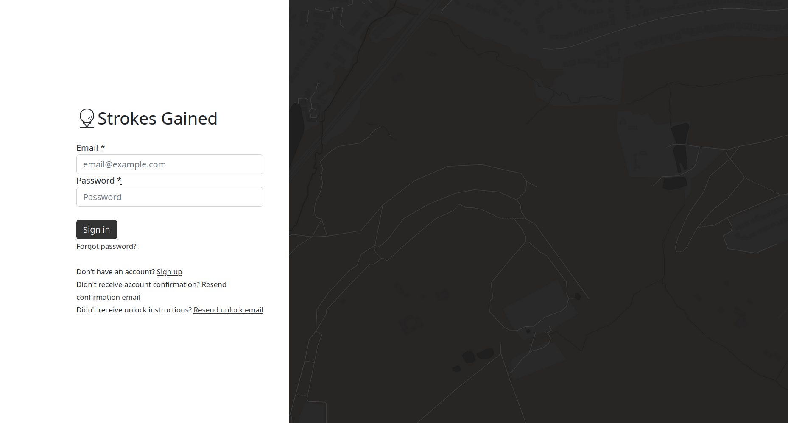

**95% individual grade · Software Hut Prize (Client Awarded)**

For this project, my team and I were requested by our client to create a system which they could use to take a more data-driven approach to their play on various golf courses. Through weekly client meetings, we captured requirements via story cards in a kanban board, as well as a document containing mockups and specific non-functional requirements. The app that we created uses role-based access to distinguish between two categories of user: map creators, who use the annotation tool to create detailed course maps, and regular users who leverage this data to improve their game using the "strokes gained" metric.

### Login

The application includes a login interface with golf course imagery in the background.

*The login page of my team's software hut project*

### Map creator functionality

Map interactions were built with Leaflet for the base map and Leaflet Geoman for drawing capabilities. Custom polygon controls were created for different terrain types, styled with SCSS variables to maintain consistency across the interface. Map creators can assign tags (such as "In Development" or "Complete") to control user visibility. The Overpass Turbo API pre-populated the database with golf course locations from OpenStreetMap, so creators only needed to add hole details.

<video autoplay loop muted playsinline width="1024" height="552" src="/projects/software-hut/map-creation.mp4"></video>

*An example of how a map creator might use the system.*

### User annotation

Users can annotate maps in the same way as creators, with their annotations stored in personal database tables rather than the shared course databases.

<video autoplay loop muted playsinline width="1024" height="552" src="/projects/software-hut/user-optimal.mp4"></video>

*An example of how a user might use the system.*

### Shot optimisation algorithm

An algorithm lets users identify optimal shots: the system samples points across dispersion patterns, calculates average strokes gained within a 150° cone centred on the hole, and accounts for tree obstruction — marking shots as blocked if within 20 metres of intersecting trees, based on an assumed 20-metre tree height derived from ball trajectory physics.
